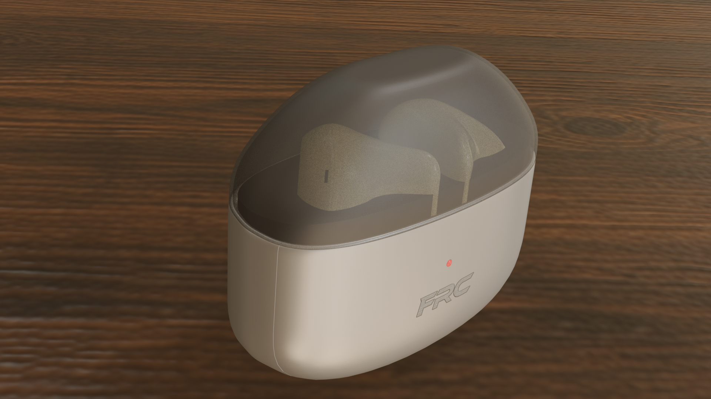
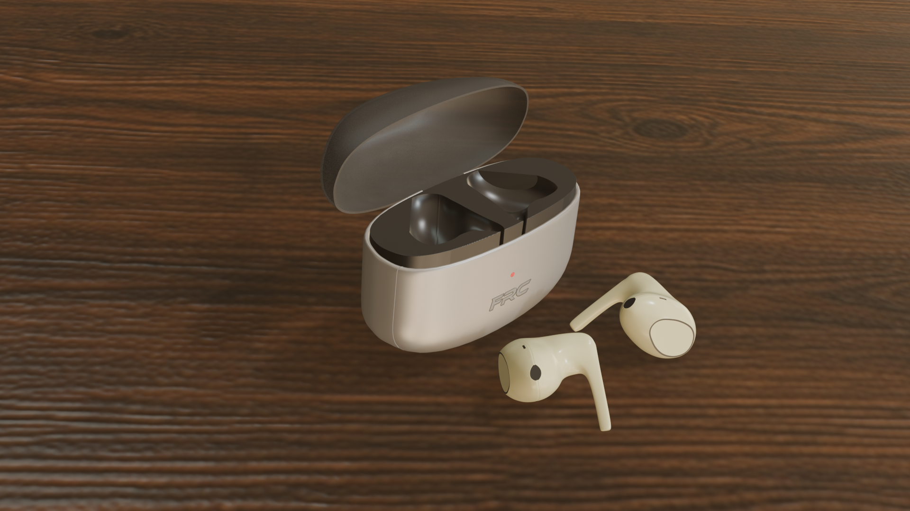
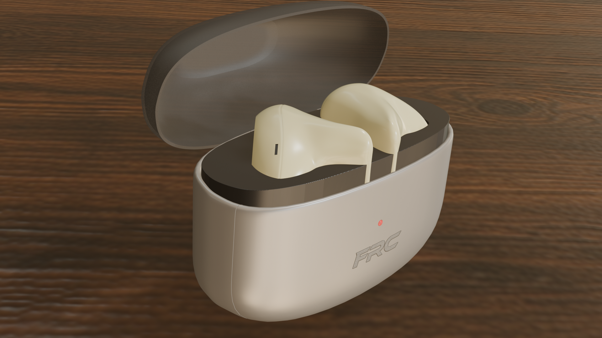

# 🎧 Bluetooth Earplug System -- 3D Asset (Blender 5.0)

------------------------------------------------------------------------

## 📌 Projektübersicht

Dieses Repository enthält ein vollständig in **Blender 5.0** erstelltes
3D-Modell eines modernen Bluetooth‑Earplug-Systems.

Die Modellierung basiert auf einer realen Referenz (eigene Kopfhörer)
und wurde konstruktiv angepasst sowie technisch optimiert.

------------------------------------------------------------------------

## 🖼 Renderings

### 🔹 Komplettansicht

### 🔹 Außenansicht

### 🔹 Geöffnetes System

------------------------------------------------------------------------

## ⚙ Technische Details

  Kategorie   Information
  ----------- -----------------------------
  Software    Blender 5.0
  Modeling    Hard Surface Workflow
  Texturen    2K PBR
  Referenz    Eigene Hardware als Vorlage

------------------------------------------------------------------------

## 🧰 Verwendete Addons

-   LoopTools\
-   UCUPaint\
-   HardOps\
-   BoxCutter

------------------------------------------------------------------------

## 🎨 Texturierung

Alle 2K PBR-Texturen befinden sich im Repository.

Enthalten sind:

-   BaseColor\
-   Normal\
-   Ambient Occlusion (AO)\
-   Height

Die Texturen sind für PBR-Workflows optimiert und direkt
weiterverwendbar.

------------------------------------------------------------------------

## 📂 Repository-Struktur

    / (Root)
    │
    ├── KomplettRendering.png
    ├── KopfhoererAussen.png
    ├── KopfhoererOffen.png
    │
    ├── /Textures
    │   ├── *_BaseColor_2K.*
    │   ├── *_Normal_2K.*
    │   ├── *_AO_2K.*
    │   └── *_Height_2K.*
    │
    └── Blender Projektdatei(en)

------------------------------------------------------------------------

## 🏷 Autor

**Norman Fober**\
NohaDesign

------------------------------------------------------------------------

*Projekt zu Demonstrations- und Portfoliozwecken.*
